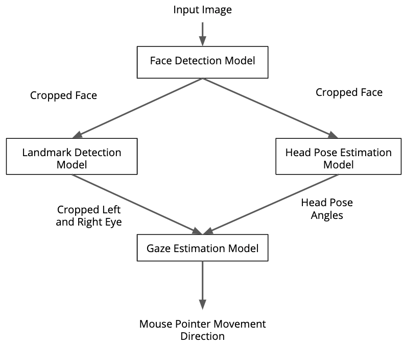
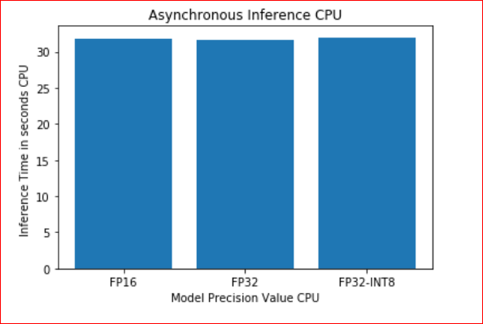
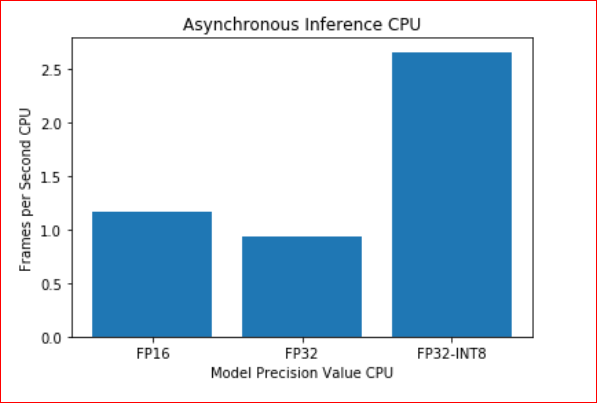
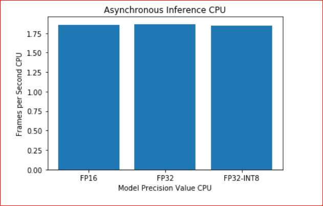
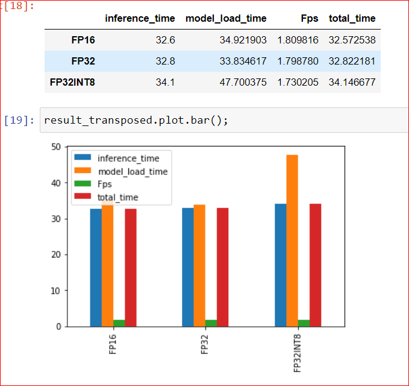
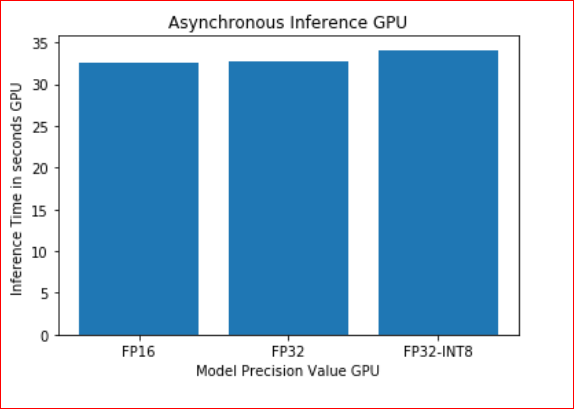
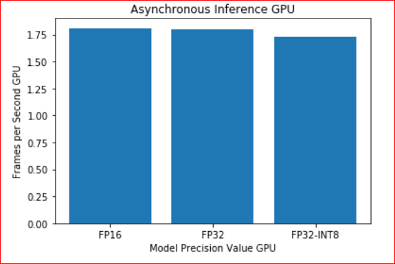
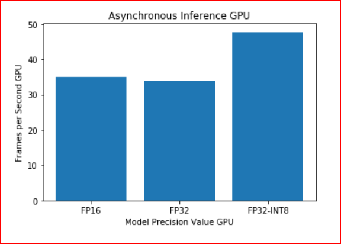


Pleas see the folder Analysis Project subfolder OpenVino Compute Pointer Controller.html and file P05 Computer Pointer Controller.pdf Benchmark results of the project.

# Computer Pointer Controller

In this project, you will use a Gaze Detection Model[Gaze Detection Model](https://docs.openvinotoolkit.org/latest/_models_intel_gaze_estimation_adas_0002_description_gaze_estimation_adas_0002.html) to control the mouse pointer of your computer. 
You will be using the Gaze Estimation model to estimate the gaze of the user's eyes and change the mouse pointer position accordingly.
This project will demonstrate your ability to run multiple models in the same machine and coordinate the flow of data between those models.  
The gaze estimation model requires three inputs  you will have to use three other OpenVino models:

The head pose
The left eye image
The right eye image.

## Project requires and Installation
- Install intel distribution of openvino for Windows 10 [here](https://docs.openvinotoolkit.org/2020.2/_docs_install_guides_installing_openvino_windows.html)

To get these inputs, you will have to use three other OpenVino models:

* [Face Detection](https://docs.openvinotoolkit.org/latest/_models_intel_face_detection_adas_0001_description_face_detection_adas_0001.html)
* [Head Pose Estimation](https://docs.openvinotoolkit.org/latest/_models_intel_head_pose_estimation_adas_0001_description_head_pose_estimation_adas_0001.html)
* [Facial Landmarks Detection](https://docs.openvinotoolkit.org/latest/_models_intel_landmarks_regression_retail_0009_description_landmarks_regression_retail_0009.html)


### The Pipeline:
You will have to coordinate the flow of data from the input, and then amongst the different models and finally to the mouse controller. The flow of data will look like this:



## Project Set Up and Installation:

Step1. Download **[OpenVino Toolkit 2020.2](https://docs.openvinotoolkit.org/latest/index.html)** with all the prerequisites by following this [installation guide](https://docs.openvinotoolkit.org/2020.1/_docs_install_guides_installing_openvino_windows.html)

Step2. Create Virtual Environment using command `virtualenv venv` in the command prompt

Step4. install all the dependency using `pip install requirements.txt`.

Step4: Download model from `OpenVino Zoo` using below four commands, This commands will download four required model with all the precisions available in the default output location.

```
python3 /opt/intel/openvino/deployment_tools/open_model_zoo/tools/downloader/downloader.py --name gaze-estimation-adas-0002 
python3 /opt/intel/openvino/deployment_tools/open_model_zoo/tools/downloader/downloader.py --name face-detection-adas-0001  
python3 /opt/intel/openvino/deployment_tools/open_model_zoo/tools/downloader/downloader.py --name head-pose-estimation-adas-0001  
python3 /opt/intel/openvino/deployment_tools/open_model_zoo/tools/downloader/downloader.py --name landmarks-regression-retail-0009

```

### Initialize OpenVino environment

## Demo:

run by  python 3.6 during environ create step..

Step1. Open command prompt Activate Virtual Environment 

```
< User PC > virtualenv venv
cd venv/Scripts/
activate
```

Step2. Instantiate OpenVino Environment. For windows use below command
```
cd C:\Program Files (x86)\IntelSWTools\openvino\bin\
setupvars.bat
```

Step3. Go back to the project directory `src` folder

```
Install the project requirements by running 

pip install -r requirements.txt
```
 - install numpy `conda install numpy`
 - Install `pyautogui` using command `conda install -c conda-forge pyautogui`
 - Below is the output of `pip freeze` command. Check if I have missed something:
  ```
  certifi==2020.4.5.1
  mkl-fft==1.0.15
  mkl-random==1.1.0
  mkl-service==2.3.0
  numpy==1.18.1
  olefile==0.46
  Pillow==5.3.0
  PyAutoGUI==0.9.48
  PyMsgBox==1.0.7
  pyobjc-core==6.2
  pyobjc-framework-Cocoa==6.1
  pyobjc-framework-Quartz==5.3
  PyScreeze==0.1.26
  PyTweening==1.0.3
  six==1.14.0
  ```
cd path_of_project_directory
cd src

Step4. Command Line Arguments for Running the app

Following are commanda line arguments that can use for while running the main.py file python main.py:-
1. -h (required) : Get the information about all the command line arguments
2. -fdm (required) : (required) Specify the path of Face Detection model's name as  shown below for specific precision FP32, FP16, INT8
3. lrm : required) Specify the path of Facial landmarks Detection model's name for specific precision FP32, FP16,INT8
4. -hpm (required) : (required) Specify the path of haed pose Detection model's name for specific precision FP32, FP16,INT8
5. -gem (required) : (required) Specify the path of gaze estimation model's name for specific precision FP32, FP16, INT8
6. -inp (required) : Specify the path of input video file or enter cam for taking input video from webcam
7. -prob (optional) : Specify the probability threshold for face detection model to detect the face accurately from video frame.
8. -flags (optional): Specify the flags from face_frame, face_eyes frame, hpm, ge if you want to visualize the output of corresponding models of each frame (write flags with space seperation. Ex:- -flags face_frame face_eyes).
9. - d (Optional): Specify Device for inference, the device can be CPU, GPU,FPGA (For running on FPGA used HETERO:FPGA,CPU), MYRIAD.
10. - o : Specify path of output folder where we will store outcomes_CPU and outcomes_GPU
      
Step5. Run below commands to execute the project

 
### To run model on CPU use below command in terminal window:
```
### Type CPU -FP32-INT8

python main.py -fdm C:/UdaciteProject/starter/models/face-detection-adas-0001/FP32-INT8/face-detection-adas-0001.xml 
-lrm C:/UdaciteProject/starter/models/landmarks-regression-retail-0009/FP32-INT8/landmarks-regression-retail-0009.xml 
-hpm C:/UdaciteProject/starter/models/head-pose-estimation-adas-0001/FP32-INT8/head-pose-estimation-adas-0001.xml -gem C:/UdaciteProject/starter/models/gaze-estimation-adas-0002/FP32-INT8/gaze-estimation-adas-0002.xml 
-inp C:/UdaciteProject/starter/bin/demo.mp4 -d CPU -o C:/UdaciteProject/starter/outcomes_CPU/FP32-INT8/ -flags face_frame face_eyes
```

### Type CPU -FP16
```
python main.py -fdm C:/UdaciteProject/starter/models/face-detection-adas-0001/FP16/face-detection-adas-0001.xml 
-lrm C:/UdaciteProject/starter/models/landmarks-regression-retail-0009/FP16/landmarks-regression-retail-0009.xml
-hpm C:/UdaciteProject/starter/models/head-pose-estimation-adas-0001/FP16/head-pose-estimation-adas-0001.xml 
-gem C:/UdaciteProject/starter/models/gaze-estimation-adas-0002/FP16/gaze-estimation-adas-0002.xml 
-inp C:/UdaciteProject/starter/bin/demo.mp4 -d CPU -o C:/UdaciteProject/starter/outcomes_CPU/FP16/ -flags face_frame face_eyes
```

### Type CPU -FP32
```
python main.py -fdm C:/UdaciteProject/starter/models/face-detection-adas-0001/FP32/face-detection-adas-0001.xml 
-lrm C:/UdaciteProject/starter/models/landmarks-regression-retail-0009/FP32/landmarks-regression-retail-0009.xml
-hpm C:/UdaciteProject/starter/models/head-pose-estimation-adas-0001/FP32/head-pose-estimation-adas-0001.xml 
-gem C:/UdaciteProject/starter/models/gaze-estimation-adas-0002/FP32/gaze-estimation-adas-0002.xml 
-inp C:/UdaciteProject/starter/bin/demo.mp4 -d CPU -o C:/UdaciteProject/starter/outcomes_CPU/FP32/ -flags face_frame face_eyes
``` 


### To run model on GPU use below command in terminal window:

### Type GPU-FP32-INT8
```
python main.py -fdm C:/UdaciteProject/starter/models/face-detection-adas-0001/FP32-INT8/face-detection-adas-0001.xml 
-lrm C:/UdaciteProject/starter/models/landmarks-regression-retail-0009/FP32-INT8/landmarks-regression-retail-0009.xml 
-hpm C:/UdaciteProject/starter/models/head-pose-estimation-adas-0001/FP32-INT8/head-pose-estimation-adas-0001.xml 
-gem C:/UdaciteProject/starter/models/gaze-estimation-adas-0002/FP32-INT8/gaze-estimation-adas-0002.xml 
-inp C:/UdaciteProject/starter/bin/demo.mp4 -d GPU -o C:/UdaciteProject/starter/outcomes_GPU/FP32-INT8/ -flags face_frame face_eyes
```
### Type GPU-FP16
```
python main.py -fdm C:/UdaciteProject/starter/models/face-detection-adas-0001/FP16/face-detection-adas-0001.xml 
-lrm C:/UdaciteProject/starter/models/landmarks-regression-retail-0009/FP16/landmarks-regression-retail-0009.xml 
-hpm C:/UdaciteProject/starter/models/head-pose-estimation-adas-0001/FP16/head-pose-estimation-adas-0001.xml 
-gem C:/UdaciteProject/starter/models/gaze-estimation-adas-0002/FP16/gaze-estimation-adas-0002.xml 
-inp C:/UdaciteProject/starter/bin/demo.mp4 -d GPU -o C:/UdaciteProject/starter/outcomes_GPU/FP16/ -flags face_frame face_eyes
```
### Type GPU-FP32
```
python main.py -fdm C:/UdaciteProject/starter/models/face-detection-adas-0001/FP32/face-detection-adas-0001.xml 
-lrm C:/UdaciteProject/starter/models/landmarks-regression-retail-0009/FP32/landmarks-regression-retail-0009.xml 
-hpm C:/UdaciteProject/starter/models/head-pose-estimation-adas-0001/FP32/head-pose-estimation-adas-0001.xml 
-gem C:/UdaciteProject/starter/models/gaze-estimation-adas-0002/FP32/gaze-estimation-adas-0002.xml 
-inp C:/UdaciteProject/starter/bin/demo.mp4 -d GPU -o C:/UdaciteProject/starter/outcomes_GPU/FP32/ -flags face_frame face_eyes
```
- **src** 
  * This folder contains model files, pipeline file(main.py) and utilities

   * model.py is the model class file which has common property of all the other model files. It is inherited by all the other model files 
        This folder has 4 model class files, This class files has methods to load model and perform inference.
   * face_detection_model.py
   * gaze_estimation_model.py
   * landmark_detection_model.py
   * head_pose_estimation_model.py
   * main.py file used to run complete pipeline of project. It calls has object of all the other class files in the folder
   * mouse_controller.py is utility to move mouse curser based on mouse coordinates received from gaze_estimation_model class predict method.
   * input_feeder.py is utility to load local video or webcam feed

- **models**
  * Ideally this directory should have all the downloaded model, but you can choose some other directory as well to store the models.
  * models folder contains subfolder for each model where corresponding inference files are downloaded for FP32, FP16 and FP32-INT8. 
-**bin**
  * this folder has demo.mp4 file which can be used to test model
- **Analysis Project**
   * Analysis Project folder This folder contains tow files OpenVino Compute Pointer Controller.html and OpenVino Compute Pointer Controller.html 
     Analyze implementation results from folders outcomes_GPU and outcomes_CPU by stats.txt
    
- **images**
  * This folder has graph/plot of the results of this application. It also has other images like pipeline diagram which are used in readme file.


## Benchmarks

* I ran the model inference on CPU and GPU device on local machine given same input video and same virtual environment. Listed below are hardware versions:
    Model precisions tested:

  FP32
  FP16
  INT8
  Hardwares tested:

   CPU (2.3 GHz Intel Core i5)
   GPU (Intel(R) UHD Graphics 630)

I have checked Inference Time, Model Loading Time, and Frames Per Second model for FP16, FP32, and FP32-INT8


**Benchmark results of the model. CPU(FP32-INT8,FP16,FP32) and Asynchronous Inference**


   |  
 :---------------------------------------:|:---------------------------------------:
   |  
</br>


**Benchmark results of the model. GPU(FP32-INT8,FP16,FP32) and Asynchronous Inference**

   |  
 :---------------------------------------:|:---------------------------------------:
   |  
</br>


* Due to non availability of FPGA and VPU in local machine, I did not run inference for these device types.


* FP32

  | Type of Hardware | Total inference time              | Total load time              | fps        |
  |------------------|-----------------------------------|------------------------------|------------|
  | CPU              |  31.6s                            | 0.930308s                    | 1.867089   |
  | GPU              |  32.8s                            | 33.834617s                   | 1.798780   |


* FP16
  
  
  
  | Type of Hardware | Total inference time              | Total load time               | fps       |
  |------------------|-----------------------------------|-------------------------------|-----------|
  | CPU              |  31.8s                            |  1.165073s                    | 1.855346  |
  | GPU              |  32.6s                            |  34.921903s                   | 1.809816  |


* FP32-INT8

  
  | Type of Hardware | Total inference time              | Total load time               | fps      |
  |------------------|-----------------------------------|-------------------------------|----------|
  | CPU              |  32.0s                            | 2.662999s                     | 1.843750 |
  | GPU              |  34.1s                            | 47.700375s                    | 1.730205 |


## Results
 The Some of the observations from benchmark results:
* Model load time significantly increases when device is switch from CPU to GPU as expected. Model takes considerably longer to load in GPU as we analyzed from prior project study.
* Model load time is reduced when preicison is changed from FP32 to FP16 to INT8. This is because as weight are quantized and reduced in size then load time is also reduced.
* Model inference time is slighly improved when changing precision from FP32 to FP16 and from FP32 to INT8. This is expected as accuracy decrease performance improves. There is slight increase in inference time when changing precision from FP16 to INT8.
* Model inference time is increased when changing device from CPU to GPU. Here we can get better performance only when batch inferencing is done on GPU to leverage full compute capacity of GPU.
* Frames per second is pretty consistent irrespective of precision but it slightly reduces as device is changed from CPU to GPU.
Here again fps can be increased on GPU device if batch inferencing is done.
* For `Inference Time FPS ,and load time FP32 and FP16  give slightly better results. There is not much difference for this three different models for this two parameters.
* I have tested model for Asynchronous Inference and Synchronous Inference, Asynchronous Inference has better results it has slight improvement in `inference time` and `FPS`


### Edge Cases

  * When performing inference using web cam feed as input, mouse controller crashed when pointer moved to corner of the screen. To overcome this problem I had to set        pyautogui.FailSafe to false in MouseController class .
  This feature is enabled by default so that you can easily stop execution of your pyautogui program by manually moving the mouse to the upper left corner of the screen.  


Edge Cases
1.The lighting matters greatly for the video feed, so sometimes models does not clearly views the gaze.
2.If for some reason model can not detect the face then it throws off track and pointer continues in same direction.
3.If there are more than one face detected in the frame then model takes the first detected face for control the mouse pointer.


### Project Directory Structure

```
C:\UdaciteProject>tree /F
Folder PATH listing for volume Windows
```
  ```bash
C:.
|--starter
    │--Commend Run the project.txt
    │--Intel(R) UHD Graphics 630 Sunday, July 5, 2020.txt
    │--P05 Computer Pointer Controller.pdf
    │--README.md
    │--requirements.txt
    │
    |--Analysis Project
    │      |-- OpenVino Compute Pointer Controller .html
    │      |--OpenVino Compute Pointer Controller .ipynb
    │
    |--bin
    │    |--demo.mp4
    │    |--output_video.mp4
    │
    |---models
    │   |--face-detection-adas-0001
    │   │   ├───FP16
    │   │   │       face-detection-adas-0001.bin
    │   │   │       face-detection-adas-0001.xml
    │   │   │
    │   │   ├───FP32
    │   │   │       face-detection-adas-0001.bin
    │   │   │       face-detection-adas-0001.xml
    │   │   │
    │   │   └───FP32-INT8
    │   │           face-detection-adas-0001.bin
    │   │           face-detection-adas-0001.xml
    │   │
    │   ├───gaze-estimation-adas-0002
    │   │   ├───FP16
    │   │   │       gaze-estimation-adas-0002.bin
    │   │   │       gaze-estimation-adas-0002.xml
    │   │   │
    │   │   ├───FP32
    │   │   │       gaze-estimation-adas-0002.bin
    │   │   │       gaze-estimation-adas-0002.xml
    │   │   │
    │   │   └───FP32-INT8
    │   │           gaze-estimation-adas-0002.bin
    │   │           gaze-estimation-adas-0002.xml
    │   │
    │   ├───head-pose-estimation-adas-0001
    │   │   ├───FP16
    │   │   │       head-pose-estimation-adas-0001.bin
    │   │   │       head-pose-estimation-adas-0001.xml
    │   │   │
    │   │   ├───FP32
    │   │   │       head-pose-estimation-adas-0001.bin
    │   │   │       head-pose-estimation-adas-0001.xml
    │   │   │
    │   │   └───FP32-INT8
    │   │           head-pose-estimation-adas-0001.bin
    │   │           head-pose-estimation-adas-0001.xml
    │   │
    │   └───landmarks-regression-retail-0009
    │       ├───FP16
    │       │       landmarks-regression-retail-0009.bin
    │       │       landmarks-regression-retail-0009.xml
    │       │
    │       ├───FP32
    │       │       landmarks-regression-retail-0009.bin
    │       │       landmarks-regression-retail-0009.xml
    │       │
    │       └───FP32-INT8
    │               landmarks-regression-retail-0009.bin
    │               landmarks-regression-retail-0009.xml
    │
    ├───outcomes_CPU
    │   ├───FP16
    │   │       stats.txt
    │   │
    │   ├───FP32
    │   │       stats.txt
    │   │
    │   └───INT8
    │           stats.txt
    │
    ├───outcomes_GPU
    │   ├───FP16
    │   │       stats.txt
    │   │
    │   ├───FP32
    │   │       stats.txt
    │   │
    │   └───INT8
    │           stats.txt
    │
    └───src
        │   face_detection_model.py
        │   gaze_estimation_model.py
        │   head_pose_estimation_model.py
        │   input_feeder.py
        │   landmark_detection_model.py
        │   main.py
        │   model.py
        │   mouse_controller.py
        │   output_video.mp4
        │
        └───__pycache__
                face_detection_model.cpython-36.pyc
                gaze_estimation_model.cpython-36.pyc
                head_pose_estimation_model.cpython-36.pyc
                input_feeder.cpython-36.pyc
                landmark_detection_model.cpython-36.pyc
                model.cpython-36.pyc
                mouse_controller.cpython-36.pyc

```

